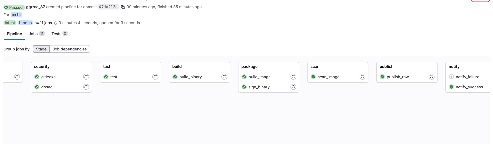
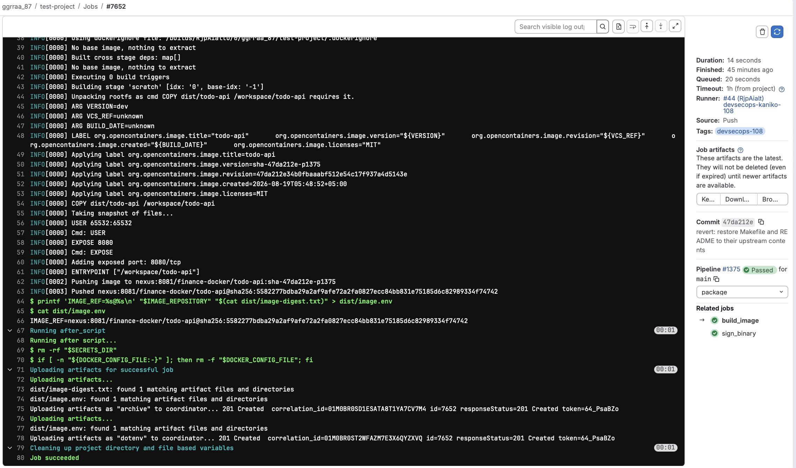
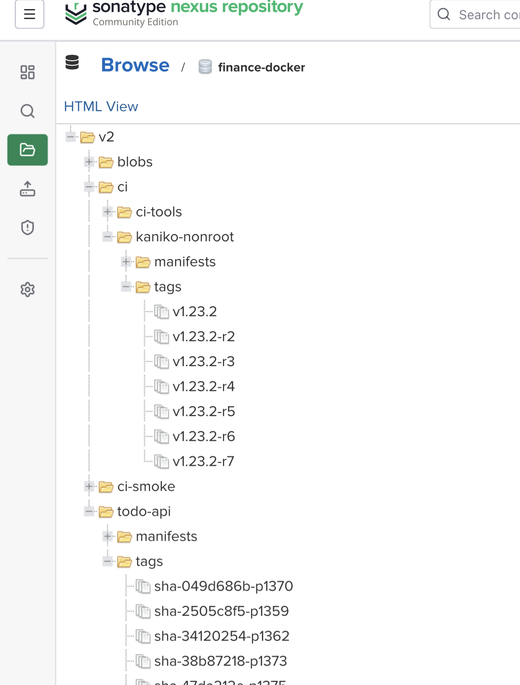
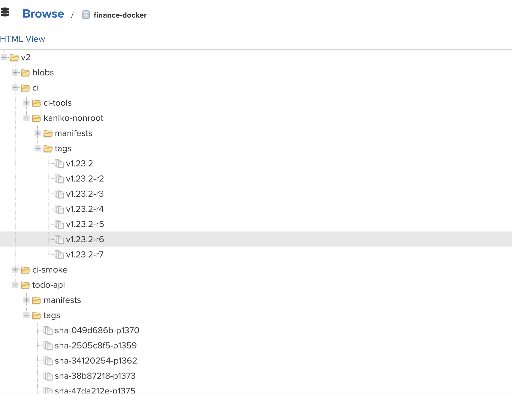
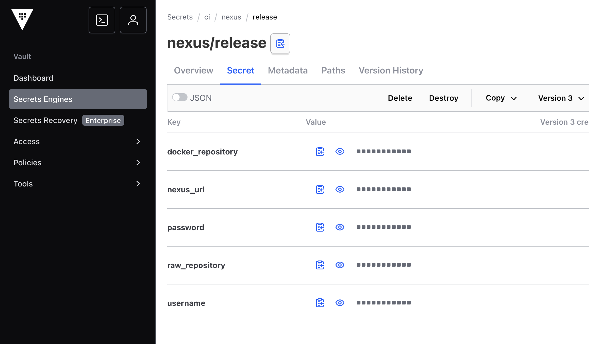

# DevSecOps CI/CD для Go-сервиса

Репозиторий содержит общий GitLab CI-шаблон и инфраструктурные файлы для сборки,
проверки и публикации Go-сервиса.

## Что делает pipeline

```text
validate → security → test → build → package → scan → publish → notify
```

Pipeline проверяет и тестирует Go-код, собирает статический бинарник, упаковывает его
в минимальный Docker-образ, подписывает и сканирует результат, публикует образ и
сборочные артефакты в Nexus, после чего уведомляет внешнюю систему.

Сборочная и runtime-среды разделены: компиляция выполняется в образе с Go toolchain,
а в итоговый `scratch`-образ попадает только готовый статический бинарник.

## Технические решения

| Область | Решение |
|---|---|
| Сборка образа | Kaniko в отдельном non-root job без privileged mode и Docker socket |
| Пользователь | Все job и runtime-контейнер работают с числовым non-root UID; UID проверяется перед выполнением команд |
| Секреты | Хранятся в Vault и выдаются только после аутентификации по краткоживущему GitLab ID token |
| Подпись | Выполняется Vault Transit; закрытый ключ не покидает Vault, а результат проверяется обычным OpenSSL |
| Тесты | `go test -race` и контроль покрытия кода |
| Проверка кода | Gosec и Gitleaks |
| Проверка образа | Trivy сканирует собранный образ по immutable digest |
| Runtime | `scratch`, статический бинарник и numeric non-root user |
| Хранилище | Nexus проксирует Go-модули и базовые образы, хранит Docker-образы и сборочные артефакты |
| Уведомление | Python-скрипт отправляет webhook по HTTPS; тело защищено HMAC-SHA256 и idempotency key |
| Шаблонизация | Приложение подключает общий CI-шаблон по immutable commit SHA |
| Разделение прав | `main` использует snapshot-учётную запись Nexus, protected release tag — release-учётную запись |
| Сертификаты | Доверенные публичные сертификаты монтируются runner только для чтения и не хранятся в приложении |

## Поток доступа к секретам

```text
GitLab job
  → получает краткоживущий ID token
  → Vault проверяет project, audience и protected ref
  → выдаёт ограниченный Vault token
  → job получает только необходимые Nexus/webhook permissions
```

Постоянный Vault token, пароль Nexus и подписывающий ключ в GitLab variables не
хранятся. Для `main` и release tag используются разные Vault-роли и Nexus credentials.

## Публикуемые результаты

В Nexus Docker Registry публикуется runtime-образ по tag и digest. В Nexus Raw
Repository публикуются:

- статический бинарник;
- SHA-256 checksum;
- подпись бинарника;
- digest и подпись Docker-образа;
- отчёты проверок безопасности;
- ссылка на собранный образ.

## Скриншоты

**Pipeline GitLab**



**Сборка образа**



**Nexus Registry**



**Теги образов**



**Секреты Vault**



## Основные файлы

- [templates/go-kaniko.yml](https://github.com/Ggrraa87/test-project-devops/blob/main/templates/go-kaniko.yml) — общий GitLab CI pipeline;
- [templates/stand.yml](https://github.com/Ggrraa87/test-project-devops/blob/main/templates/stand.yml) — централизованные параметры стенда;
- [images/ci-tools/Dockerfile](https://github.com/Ggrraa87/test-project-devops/blob/main/images/ci-tools/Dockerfile) — образ с Go и инструментами проверок;
- [infrastructure/kaniko-runner/kaniko-nonroot.Dockerfile](https://github.com/Ggrraa87/test-project-devops/blob/main/infrastructure/kaniko-runner/kaniko-nonroot.Dockerfile) — non-root Kaniko builder;
- [Dockerfile приложения](https://github.com/Ggrraa87/test-project/blob/main/Dockerfile) — минимальный runtime-образ сервиса;
- [.gitlab-ci.yml приложения](https://github.com/Ggrraa87/test-project/blob/main/.gitlab-ci.yml) — подключение общего шаблона по commit SHA.

## Репозитории

- [Исходный Go-проект](https://github.com/NoroSaroyan/go-rest-api-example);
- [Приложение с подключённым CI](https://github.com/Ggrraa87/test-project);
- [DevOps-шаблон и инфраструктура](https://github.com/Ggrraa87/test-project-devops).
